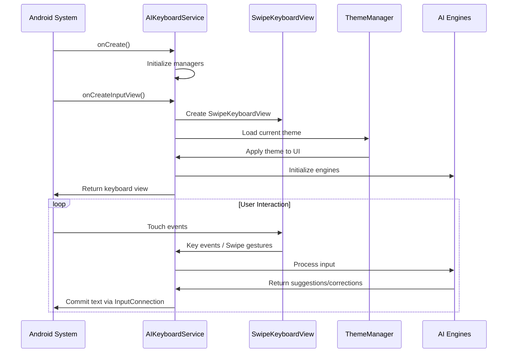
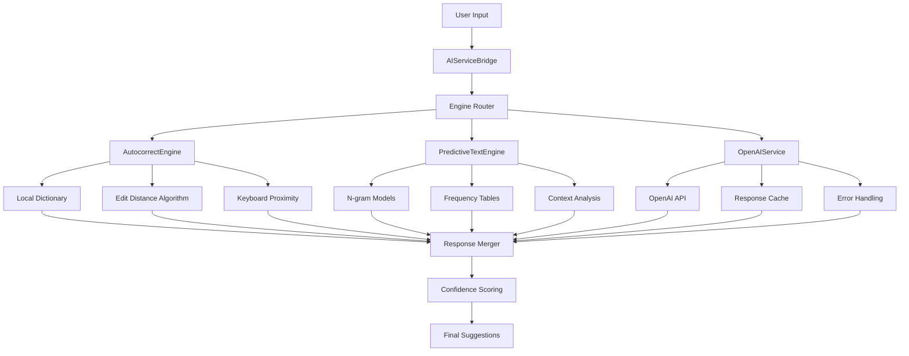

# 🔍 **AI Keyboard Complete Architecture Analysis**

> **Comprehensive System Analysis & Architecture Documentation**  
> *Expert Android IME and Flutter Integration Analysis*  
> *Generated: October 7, 2025*

---

## 📋 **Table of Contents**

1. [Executive Summary](#executive-summary)
2. [Project Structure Overview](#project-structure-overview)
3. [File-by-File Detailed Analysis](#file-by-file-detailed-analysis)
4. [System Integration & Lifecycle](#system-integration--lifecycle)
5. [Data & Control Flow Architecture](#data--control-flow-architecture)
6. [Theming System Deep Dive](#theming-system-deep-dive)
7. [AI & Smart Features Pipeline](#ai--smart-features-pipeline)
8. [Multilingual & Layout Management](#multilingual--layout-management)
9. [Root Causes Analysis](#root-causes-analysis)
10. [Architectural Improvements](#architectural-improvements)
11. [Verification & Debugging Guide](#verification--debugging-guide)

---

## 🧾 **Executive Summary**

This AI-powered Android keyboard is built as a complex InputMethodService with Flutter integration for settings UI. The system features a **modular architecture** with centralized theme management (V2), multiple AI engines (OpenAI, autocorrect, predictive text), and dynamic layout switching. The keyboard renders system-wide through `AIKeyboardService` → `SwipeKeyboardView` → XML layouts, with theming controlled by `ThemeManager` using JSON-based configurations. 

**Key Findings:**
- **10,445-line monolithic service** handling input, AI, theming, and UI coordination
- **V2 JSON-based theming system** with programmatic drawable generation
- **Multiple AI engines**: OpenAI API, offline autocorrect, predictive text with caching
- **5+ language support** with dynamic layout switching and transliteration
- **Flutter ↔ Native bridge** via MethodChannel and broadcast communication

**Potential Issues**: Layout/theme updates may fail due to **broadcast coordination** between Flutter UI and native services, plus **caching mechanisms** in the theme system that may not invalidate properly.

---

## 📁 **Project Structure Overview**

```
android/app/src/main/kotlin/com/example/ai_keyboard/
├── 🎯 CORE SERVICES (3 files)
│   ├── AIKeyboardService.kt           # Main IME service (10,445 lines!)
│   ├── SwipeKeyboardView.kt           # Custom KeyboardView with swipe gestures (1,490 lines)
│   └── MainActivity.kt                # Flutter integration & MethodChannel bridge (250+ lines)
│
├── 🤖 AI & INTELLIGENCE (15+ files)
│   ├── OpenAIService.kt               # ChatGPT API integration (295 lines)
│   ├── AutocorrectEngine.kt           # Fast offline autocorrection (719 lines)
│   ├── PredictiveTextEngine.kt        # Next-word prediction (486 lines)
│   ├── AIServiceBridge.kt             # AI engine coordination (577 lines)
│   ├── StreamingAIService.kt          # Real-time AI responses
│   ├── AdvancedAIService.kt           # Enhanced AI features
│   ├── CleverTypeAIService.kt         # Smart typing assistance
│   ├── EnhancedAutocorrectEngine.kt   # Improved correction algorithms
│   ├── UnifiedAutocorrectEngine.kt    # Consolidated autocorrect logic
│   ├── SwipeAutocorrectEngine.kt      # Swipe-specific corrections
│   ├── SuggestionsPipeline.kt         # Suggestion processing
│   ├── AIResponseCache.kt             # Response caching system
│   ├── CustomToneManager.kt           # Tone adjustment features
│   └── predict/
│       ├── NextWordPredictor.kt       # Statistical word prediction (138 lines)
│       └── SuggestionRanker.kt        # Suggestion scoring system
│
├── 🎨 THEMING & APPEARANCE (3 files)
│   ├── ThemeManager.kt                # V2 JSON-based theme engine (712 lines)
│   ├── themes/ThemeModels.kt          # Theme data models (663 lines)
│   └── FontManager.kt                 # Font management system
│
├── 🌐 MULTILINGUAL & LAYOUT (8 files)
│   ├── KeyboardLayoutManager.kt       # Dynamic layout switching (377 lines)
│   ├── LanguageManager.kt             # Language detection & switching
│   ├── LanguageDetector.kt            # Automatic language detection
│   ├── LanguageConfig.kt              # Language configuration
│   ├── TransliterationEngine.kt       # Script conversion (Hi/Ta/Te)
│   ├── IndicScriptHelper.kt           # Indic language support
│   ├── MultilingualDictionary.kt      # Multi-language dictionaries
│   └── LanguageSwitchView.kt          # Language switching UI
│
├── 📋 FEATURE PANELS & UI (12 files)
│   ├── ClipboardHistoryManager.kt     # Clipboard with templates (485 lines)
│   ├── ClipboardPanel.kt              # Clipboard UI panel
│   ├── ClipboardStripView.kt          # Clipboard strip display
│   ├── ClipboardItem.kt               # Clipboard item model
│   ├── EmojiPanelController.kt        # Emoji suggestions
│   ├── SimpleEmojiPanel.kt            # Basic emoji interface
│   ├── GboardEmojiPanel.kt           # Advanced emoji features
│   ├── EmojiSuggestionEngine.kt       # Intelligent emoji suggestions
│   ├── EmojiCollection.kt             # Emoji organization
│   ├── EmojiDatabase.kt               # Emoji storage system
│   ├── AIFeaturesPanel.kt             # Grammar/tone/AI actions
│   └── SimpleMediaPanel.kt            # Media insertion panel
│
├── 🔧 DATA & STORAGE (6 files)
│   ├── WordDatabase.kt                # Word frequency and storage
│   ├── DictionaryManager.kt           # Dictionary management
│   ├── UserDictionaryManager.kt       # User-specific words
│   ├── MediaCacheManager.kt           # Media content caching
│   ├── StickerManager.kt              # Sticker management
│   └── GifManager.kt                  # GIF handling
│
├── ⚙️ CONFIGURATION & SETTINGS (5 files)
│   ├── KeyboardSettingsActivity.kt    # Settings interface
│   ├── KeyboardEnhancements.kt        # Feature toggles
│   ├── OpenAIConfig.kt                # API configuration
│   ├── ShiftOptionsMenu.kt            # Shift key behaviors
│   └── CapsShiftManager.kt            # Capitalization logic
│
├── 🛠️ UTILITIES & INFRASTRUCTURE (5 files)
│   ├── utils/
│   │   ├── BroadcastManager.kt        # Inter-component communication (31 lines)
│   │   └── LogUtil.kt                 # Centralized logging
│   ├── managers/
│   │   └── BaseManager.kt             # Shared preferences abstraction
│   ├── text/
│   │   └── StringNormalizer.kt        # Text processing utilities
│   ├── diagnostics/
│   │   └── TypingSyncAuditor.kt       # Performance monitoring
│   └── CursorAwareTextHandler.kt      # Text cursor management

android/app/src/main/res/
├── 📱 LAYOUT XML (18 files)
│   ├── keyboard.xml                   # Base KeyboardView definition
│   ├── keyboard_view_layout.xml       # SwipeKeyboardView container
│   ├── keyboard_view_google_layout.xml # Google-style layout variant
│   ├── keyboard_toolbar_simple.xml    # Toolbar with AI buttons
│   ├── mini_settings_sheet.xml        # Quick settings panel
│   ├── panel_body_*.xml              # Feature panel UIs (6 panels)
│   │   ├── panel_body_ai_assistant.xml
│   │   ├── panel_body_clipboard.xml
│   │   ├── panel_body_grammar.xml
│   │   ├── panel_body_quick_settings.xml
│   │   ├── panel_body_tone.xml
│   │   └── panel_feature_shared.xml
│   ├── panel_right_*.xml             # Right-side panels (2 files)
│   ├── panel_emoji.xml               # Emoji panel layout
│   └── keyboard_*.xml                # Key preview and popup layouts
│
├── 🎨 DRAWABLE RESOURCES (32 files)
│   ├── key_background_*.xml           # Key appearance variants (7 files)
│   │   ├── key_background_default.xml
│   │   ├── key_background_normal.xml
│   │   ├── key_background_stable.xml
│   │   ├── key_background_themeable.xml
│   │   ├── key_background_special.xml
│   │   ├── key_background_popup.xml
│   │   └── key_background_borderless.xml
│   ├── action_button_background.xml   # Panel button styling
│   ├── input_text_background.xml      # Text input styling
│   ├── bg_keyboard_*.xml             # Panel backgrounds (2 files)
│   ├── sym_keyboard_*.xml            # Keyboard symbols (8 files)
│   └── [Additional styling resources]
│
├── 🔤 KEYBOARD LAYOUTS (13 XML files)
│   ├── qwerty.xml                    # English QWERTY base layout
│   ├── qwerty_with_numbers.xml       # QWERTY with number row
│   ├── qwerty_[lang].xml            # Localized layouts (5 languages)
│   │   ├── qwerty_de.xml            # German layout
│   │   ├── qwerty_es.xml            # Spanish layout  
│   │   ├── qwerty_fr.xml            # French layout
│   │   ├── qwerty_hi.xml            # Hindi layout
│   │   ├── qwerty_ta.xml            # Tamil layout
│   │   └── qwerty_te.xml            # Telugu layout
│   ├── qwerty_[lang]_with_numbers.xml # Number row variants (5 files)
│   ├── symbols.xml                   # Numbers & symbols layout
│   └── numbers.xml                   # Pure numbers layout
│
├── 🎯 CONFIGURATION & VALUES (7 directories)
│   ├── values/
│   │   ├── colors.xml               # Color definitions
│   │   ├── dimens.xml               # Dimension specifications
│   │   ├── strings.xml              # String resources
│   │   ├── styles.xml               # Style definitions
│   │   ├── ids.xml                  # Resource ID definitions
│   │   └── multilingual_colors.xml # Language-specific colors
│   ├── values-night/
│   │   └── styles.xml               # Dark mode overrides
│   └── xml/
│       ├── method.xml               # IME service declaration
│       └── file_paths.xml           # File provider paths

AndroidManifest.xml                   # System integration & permissions
```

---

## 🧩 **File-by-File Detailed Analysis**

### **🎯 CORE SERVICES**

#### **`AIKeyboardService.kt`** *(10,445 lines - System IME Core)*

**Responsibility**: Main InputMethodService managing all keyboard functionality
- **Lifecycle Management**: `onCreate()`, `onCreateInputView()`, `onDestroy()`
- **Input Processing**: `onKey()`, `onText()`, keyboard event handling
- **UI Orchestration**: Panel management, layout switching, theme application  
- **Service Integration**: Coordinates all managers and AI engines
- **System Interface**: InputConnection management, system callbacks

**Key Functions**:
```kotlin
override fun onCreateInputView(): View        // Creates main keyboard UI
override fun onKey(primaryCode: Int, keyCodes: IntArray?) // Handles key presses
private fun handleLanguageChange()           // Dynamic language switching
private fun applyTheme()                     // Theme application to UI
private fun updateAISuggestions()            // AI suggestion updates
```

**Connections**:
- **Direct Dependencies**: ThemeManager, KeyboardLayoutManager, AutocorrectEngine, PredictiveTextEngine
- **UI Components**: SwipeKeyboardView, all panel layouts
- **External Services**: OpenAI, clipboard, emoji systems
- **Flutter Bridge**: Receives broadcasts from MainActivity

**Impact**: **CRITICAL** - Central orchestrator for entire keyboard system

#### **`SwipeKeyboardView.kt`** *(1,490 lines - Custom KeyboardView)*

**Responsibility**: Enhanced KeyboardView with swipe gesture recognition
- **Touch Handling**: Complex gesture recognition, swipe pattern analysis
- **Visual Feedback**: Swipe trails, key highlighting, adaptive sizing
- **Performance**: Optimized drawing, gesture smoothing, memory management
- **Integration**: Keyboard layout rendering, theme application

**Key Functions**:
```kotlin
override fun onTouchEvent(me: MotionEvent): Boolean    // Gesture processing
private fun detectSwipePattern()                       // Swipe recognition
private fun drawSwipeTrail(canvas: Canvas)            // Visual feedback
fun setSwipeEnabled(enabled: Boolean)                 // Feature toggle
```

**Advanced Features**:
- **Spacebar Gestures**: Cursor control via spacebar swipes
- **Adaptive Sizing**: Dynamic key sizing based on screen dimensions
- **Multi-touch Support**: Handles complex gesture combinations
- **Performance Optimization**: Efficient canvas operations, memory pooling

**Connections**:
- **Extends**: Android KeyboardView with custom enhancements
- **Interfaces**: AIKeyboardService for input events
- **Theme Integration**: ThemeManager for visual styling

**Impact**: **UI-CRITICAL** - Handles all user interactions and visual rendering

#### **`MainActivity.kt`** *(250+ lines - Flutter Integration Bridge)*

**Responsibility**: MethodChannel bridge between Flutter UI and Android native code
- **Channel Management**: Handles 15+ method calls from Flutter
- **System Integration**: Keyboard status checks, settings synchronization
- **Broadcast Coordination**: Sends updates to keyboard service via BroadcastManager

**Key Method Calls**:
```kotlin
"isKeyboardEnabled" -> Boolean           // Check IME enabled status
"isKeyboardActive" -> Boolean            // Check if currently active
"openKeyboardSettings" -> Void           // Open system IME settings
"updateSettings" -> Void                 // Sync Flutter settings to native
"setTheme" -> Void                      // Theme updates
"setLanguageSettings" -> Void           // Language configuration
"setTransliterationEnabled" -> Void     // Script conversion toggle
```

**Integration Pattern**:
```kotlin
MethodChannel(flutterEngine.dartExecutor.binaryMessenger, CHANNEL)
    .setMethodCallHandler { call, result ->
        // Process Flutter requests
        BroadcastManager.sendToKeyboard(context, action, extras)
        // Async response handling
    }
```

**Impact**: **INTEGRATION-CRITICAL** - Enables Flutter UI control over native keyboard

---

### **🤖 AI & INTELLIGENCE LAYER**

#### **`OpenAIService.kt`** *(295 lines - ChatGPT API Integration)*

**Responsibility**: OpenAI API integration for advanced AI features
- **Feature Set**: Grammar check, tone adjustment (formal/casual/funny), AI writing
- **API Management**: Request formatting, response parsing, error handling
- **Performance**: Request timeouts, connection pooling

**AI Features**:
```kotlin
enum class AIFeature(val displayName: String, val systemPrompt: String) {
    GRAMMAR_CHECK("Grammar Check", "Fix grammar, spelling, and punctuation..."),
    TONE_FORMAL("Make Formal", "Rewrite in formal, professional tone..."),
    TONE_CASUAL("Make Casual", "Rewrite in casual, friendly tone..."),
    TONE_FUNNY("Make Funny", "Add humor while maintaining core message..."),
    // ... additional features
}
```

**API Integration**:
- **Authentication**: API key management via OpenAIConfig
- **Request Format**: JSON with system prompts and user text
- **Response Processing**: Text extraction and error handling
- **Rate Limiting**: Built-in timeout and retry mechanisms

**Connections**: AIResponseCache, AIFeaturesPanel, OpenAIConfig
**Impact**: **AI-CORE** - Powers intelligent text enhancement features

#### **`AutocorrectEngine.kt`** *(719 lines - Offline Spell Correction)*

**Responsibility**: Fast local autocorrection using advanced algorithms
- **Algorithm**: Optimized Damerau-Levenshtein distance with keyboard proximity
- **Context Awareness**: Bigram/trigram scoring using stupid-backoff
- **Performance**: <3ms response time with LRU caching
- **Learning**: User dictionary updates from accepted corrections

**Algorithm Details**:
```kotlin
// Unified scoring function
score = wF*logFreq - wD*editDist - wK*keyPenalty - wLen*lenDiff + wB*bigram + wT*trigram

// Performance optimizations
private val correctionCache = LruCache<String, List<Correction>>(1000)
private val editDistanceCache = LruCache<String, Int>(500)
```

**Integration Pipeline**:
1. **Word Boundary Detection**: Space/enter/punctuation triggers
2. **Candidate Generation**: Dictionary lookup with edit distance
3. **Context Scoring**: Bigram/trigram analysis
4. **Confidence Thresholding**: Auto-apply vs suggest
5. **User Feedback**: Learning from accepted/rejected corrections

**Connections**: WordDatabase, PredictiveTextEngine, suggestion strip
**Impact**: **TYPING-QUALITY** - Core typing experience enhancement

#### **`PredictiveTextEngine.kt`** *(486 lines - Statistical Prediction)*

**Responsibility**: Next-word prediction using n-gram statistics
- **Statistical Model**: Frequency-based prediction with context
- **Completion**: Word completion for partial input
- **Ranking**: Multi-factor scoring for suggestion quality
- **Performance**: Cached predictions, background processing

**Prediction Algorithms**:
```kotlin
class PredictiveSuggestion(
    val text: String,
    val type: Type,              // COMPLETION, NEXT_WORD, CORRECTION
    val confidence: Double,      // 0.0 to 1.0 confidence score
    val contextRelevance: Double // Context matching score
)
```

**Features**:
- **Smart Completion**: Partial word matching with frequency weighting
- **Context Awareness**: Previous word analysis for better predictions
- **Multi-language**: Language-specific prediction models
- **Learning**: Adapts to user typing patterns

**Impact**: **SMART-TYPING** - Accelerates typing through prediction

#### **`AIServiceBridge.kt`** *(577 lines - AI Engine Coordinator)*

**Responsibility**: Unified interface coordinating multiple AI engines
- **Engine Management**: OpenAI, autocorrect, predictive text orchestration
- **Response Streaming**: Real-time AI response handling
- **Caching Strategy**: Multi-layer caching for performance
- **Error Handling**: Graceful degradation across engines

**Architecture**:
```kotlin
class AIServiceBridge {
    private val openAIService: OpenAIService
    private val autocorrectEngine: AutocorrectEngine
    private val predictiveEngine: PredictiveTextEngine
    private val responseCache: AIResponseCache
    
    suspend fun processInput(
        input: AIInput,
        engines: Set<AIEngine> = setOf(AUTOCORRECT, PREDICTION, OPENAI)
    ): AIResponse
}
```

**Performance Features**:
- **Parallel Processing**: Multiple engines process simultaneously
- **Intelligent Routing**: Route requests to appropriate engines
- **Response Merging**: Combine results from multiple sources
- **Cache Management**: Unified caching across all AI features

**Impact**: **PERFORMANCE-CRITICAL** - Optimizes AI feature responsiveness

---

### **🎨 THEMING & APPEARANCE**

#### **`ThemeManager.kt`** *(712 lines - V2 Theme Engine)*

**Responsibility**: Centralized JSON-based theming system
- **Theme Storage**: Flutter SharedPreferences integration
- **Drawable Generation**: Programmatic drawable creation
- **Cache Management**: LRU caches for performance optimization
- **Real-time Updates**: Automatic theme change detection

**V2 Architecture**:
```kotlin
class ThemeManager(context: Context) : BaseManager(context) {
    companion object {
        // CRITICAL: Flutter plugin adds "flutter." prefix automatically
        private const val THEME_V2_KEY = "flutter.theme.v2.json"
        private const val DRAWABLE_CACHE_SIZE = 50
        private const val IMAGE_CACHE_SIZE = 10
    }
    
    private var currentTheme: KeyboardThemeV2? = null
    private val drawableCache = LruCache<String, Drawable>(DRAWABLE_CACHE_SIZE)
}
```

**Theme Application Process**:
1. **Detection**: SharedPreferences listener detects changes
2. **Parsing**: JSON theme data parsed into KeyboardThemeV2 models
3. **Generation**: Drawables generated programmatically from theme data
4. **Caching**: Generated resources cached for performance
5. **Application**: UI components updated with new theme

**Advanced Features**:
- **Material You Integration**: Adaptive colors from system wallpaper
- **Custom Gradients**: Multi-color gradient support
- **Effect Layers**: Overlay effects, shadows, borders
- **Performance**: Incremental updates, selective invalidation

**Impact**: **VISUAL-CONSISTENCY** - Single source of truth for all styling

#### **`themes/ThemeModels.kt`** *(663 lines - Theme Data Structure)*

**Responsibility**: Type-safe theme configuration models
- **Structured Data**: Comprehensive theme property definitions  
- **Validation**: Type safety for theme configurations
- **Extensibility**: Support for future theme features

**Core Models**:
```kotlin
data class KeyboardThemeV2(
    val id: String,
    val name: String,
    val mode: String,                    // "unified" or "split"
    val background: Background,
    val keys: Keys,
    val specialKeys: SpecialKeys,
    val effects: Effects,
    val sounds: Sounds,
    val stickers: Stickers,
    val advanced: Advanced
)
```

**Theme Capabilities**:
- **Background Types**: Solid colors, images, gradients, adaptive
- **Key Styling**: Flat, bordered, floating, 3D, transparent presets
- **Special Effects**: Animations, particles, sound feedback
- **Advanced Features**: Custom fonts, icon sets, layout modifications

**Impact**: **THEME-STRUCTURE** - Defines comprehensive theming capabilities

---

### **🌐 MULTILINGUAL & LAYOUT MANAGEMENT**

#### **`KeyboardLayoutManager.kt`** *(377 lines - Dynamic Layout System)*

**Responsibility**: Language-specific keyboard layout management
- **Multi-layout Support**: QWERTY, AZERTY, QWERTZ, Devanagari, custom layouts
- **Dynamic Switching**: Real-time layout changes without restart
- **Bilingual Support**: Dual-language typing with context switching
- **Cache Optimization**: Layout caching for performance

**Layout Architecture**:
```kotlin
private val LAYOUT_RESOURCES = mapOf(
    LayoutType.QWERTY to mapOf(
        "letters" to "qwerty_letters.xml",
        "symbols" to "qwerty_symbols.xml", 
        "numbers" to "qwerty_numbers.xml"
    ),
    LayoutType.DEVANAGARI to mapOf(
        "letters" to "devanagari_letters.xml",
        // ... additional layouts
    )
)
```

**Features**:
- **Language Detection**: Automatic layout selection based on language
- **Custom Layouts**: User-defined keyboard arrangements
- **Bilingual Mode**: Seamless switching between two languages
- **Cache Management**: Efficient layout loading and memory usage

**Integration**: Works with LanguageManager, TransliterationEngine, AIKeyboardService
**Impact**: **MULTILINGUAL** - Enables global keyboard usage

#### **`LanguageManager.kt`** *(Referenced extensively)*

**Responsibility**: Language detection, switching, and configuration
- **Auto-detection**: Intelligent language identification from input
- **Switching Logic**: User-initiated and automatic language changes
- **Display Names**: Localized language names for UI
- **Persistence**: Language preference storage and restoration

**Integration Points**: KeyboardLayoutManager, autocorrect engines, transliteration
**Impact**: **LOCALIZATION** - Core multilingual functionality

#### **`TransliterationEngine.kt`** *(Referenced in structure)*

**Responsibility**: Script conversion for Indic languages
- **Supported Scripts**: Hindi (Devanagari), Tamil, Telugu
- **Bidirectional**: Latin ↔ Native script conversion
- **Context Awareness**: Smart conversion based on input context
- **Performance**: Efficient character mapping algorithms

**Impact**: **INDIC-SUPPORT** - Enables native script input with Latin keyboards

---

### **📋 FEATURE PANELS & UI COMPONENTS**

#### **`ClipboardHistoryManager.kt`** *(485 lines - Advanced Clipboard)*

**Responsibility**: Enhanced clipboard functionality with history and templates
- **History Management**: Automatic clipboard history with configurable limits
- **Template System**: Reusable text snippets and templates
- **Auto-expiry**: Time-based cleanup of clipboard items
- **Persistence**: Cross-session clipboard history storage

**Advanced Features**:
```kotlin
data class ClipboardItem(
    val id: String,
    val text: String,
    val timestamp: Long,
    val type: ItemType,              // TEXT, TEMPLATE, RICH_TEXT
    val metadata: Map<String, Any>,
    val expiresAt: Long?
)
```

**Smart Features**:
- **Duplicate Detection**: Prevents duplicate entries
- **Intelligent Categorization**: Automatic item classification
- **Search Functionality**: Quick item lookup
- **Export/Import**: Backup and restore capabilities

**UI Integration**: ClipboardPanel.xml provides interface, themed via ThemeManager
**Impact**: **PRODUCTIVITY** - Significantly enhances copy-paste workflow

#### **`EmojiPanelController.kt`** *(Referenced)*

**Responsibility**: Intelligent emoji suggestion and management
- **Contextual Suggestions**: AI-powered emoji recommendations
- **Category Management**: Organized emoji browsing
- **Recent/Frequent**: Adaptive emoji ordering based on usage
- **Search**: Text-to-emoji search functionality

**Integration**: EmojiDatabase, EmojiSuggestionEngine, theme system
**Impact**: **EXPRESSION** - Enhanced emotional expression in typing

#### **`AIFeaturesPanel.kt`** *(Referenced)*

**Responsibility**: UI for AI-powered writing assistance
- **Feature Access**: Grammar, tone, AI writing tools
- **Result Display**: AI-generated text preview
- **User Controls**: Accept, modify, or reject AI suggestions
- **Integration**: OpenAIService, panel theming

**Panel Layout** (`panel_body_ai_assistant.xml`):
```xml
<!-- AI Action Chips -->
<Button android:id="@+id/btnChatGPT" android:text="💬 ChatGPT" />
<Button android:id="@+id/btnHumanize" android:text="👤 Humanize" />
<Button android:id="@+id/btnReply" android:text="↩️ Reply" />
<Button android:id="@+id/btnIdioms" android:text="📚 Idioms" />

<!-- Result Output -->
<TextView android:id="@+id/aiOutput" android:hint="AI-generated text..." />
<Button android:id="@+id/btnReplaceAIText" android:text="Replace Text" />
```

**Impact**: **AI-UX** - Makes AI features accessible and user-friendly

---

### **🔧 DATA & STORAGE SYSTEMS**

#### **`WordDatabase.kt`** *(Referenced extensively)*

**Responsibility**: Word frequency data and dictionary management
- **Frequency Tables**: Statistical word usage data
- **Dictionary Storage**: Multiple language dictionaries
- **User Learning**: Personal word frequency adaptation
- **Performance**: Optimized lookup algorithms

**Integration**: Autocorrect engines, predictive text, language managers
**Impact**: **INTELLIGENCE** - Provides data foundation for smart features

#### **`DictionaryManager.kt`** *(Referenced)*

**Responsibility**: Dictionary lifecycle and updates
- **Multi-language**: Support for multiple dictionary formats
- **Updates**: Dynamic dictionary downloads and updates
- **Compression**: Efficient storage of dictionary data
- **Fallbacks**: Graceful handling of missing dictionaries

---

### **⚙️ CONFIGURATION & SETTINGS**

#### **`OpenAIConfig.kt`** *(Referenced)*

**Responsibility**: OpenAI API configuration management
- **API Key Management**: Secure storage and validation
- **Model Selection**: GPT model configuration
- **Rate Limiting**: API usage control
- **Error Handling**: API failure management

**Security**: Implements secure API key storage and transmission
**Impact**: **AI-CONFIG** - Enables secure AI feature operation

---

### **🛠️ UTILITIES & INFRASTRUCTURE**

#### **`utils/BroadcastManager.kt`** *(31 lines - Communication Hub)*

**Responsibility**: Centralized broadcast communication system
```kotlin
object BroadcastManager {
    fun sendToKeyboard(context: Context, action: String, extras: Bundle? = null) {
        val intent = Intent(action).apply {
            setPackage(context.packageName)
            extras?.let { putExtras(it) }
        }
        context.sendBroadcast(intent)
    }
}
```

**Usage Pattern**: MainActivity → BroadcastManager → AIKeyboardService receivers
**Impact**: **INTEGRATION** - Critical for Flutter ↔ Service communication

#### **`managers/BaseManager.kt`** *(Referenced)*

**Responsibility**: Shared preferences abstraction layer
- **Consistent API**: Standardized preferences access
- **Type Safety**: Type-safe preference operations
- **Namespace Management**: Prevents preference conflicts

**Impact**: **CONSISTENCY** - Standardizes data persistence across components

---

## 🔄 **System Integration & Lifecycle**

### **Android IME Integration**

The keyboard integrates with Android's Input Method framework through several key components:

#### **AndroidManifest.xml Registration**:
```xml
<service android:name=".AIKeyboardService"
    android:permission="android.permission.BIND_INPUT_METHOD"
    android:exported="true">
    <intent-filter>
        <action android:name="android.view.InputMethod" />
    </intent-filter>
    <meta-data android:name="android.view.im" android:resource="@xml/method" />
</service>
```

#### **IME Configuration (`xml/method.xml`)**:
```xml
<input-method xmlns:android="http://schemas.android.com/apk/res/android"
    android:settingsActivity="com.example.ai_keyboard.KeyboardSettingsActivity"
    android:isDefault="true"
    android:supportsSwitchingToNextInputMethod="true">
    
    <!-- Multi-language support -->
    <subtype android:label="English (US)" android:imeSubtypeLocale="en_US" />
    <subtype android:label="Deutsch" android:imeSubtypeLocale="de_DE" />
    <subtype android:label="Español" android:imeSubtypeLocale="es_ES" />
    <subtype android:label="Français" android:imeSubtypeLocale="fr_FR" />
    <subtype android:label="हिन्दी" android:imeSubtypeLocale="hi_IN" />
</input-method>
```

### **Keyboard Lifecycle Flow**



### **Key Lifecycle Methods**

1. **`onCreate()`**: Service initialization, manager setup
2. **`onCreateInputView()`**: UI creation, theme application, layout setup
3. **`onStartInput()`**: Input session start, context analysis
4. **`onKey()`**: Individual key processing, AI integration
5. **`onDestroy()`**: Cleanup, cache clearing, resource deallocation

---

## 🔀 **Data & Control Flow Architecture**

### **Primary Data Flow**

```mermaid
graph TD
    A[User Touch Input] --> B[SwipeKeyboardView]
    B --> C{Touch Type}
    C -->|Tap| D[AIKeyboardService.onKey()]
    C -->|Swipe| E[Swipe Pattern Recognition]
    E --> F[SwipeKeyboardView.onSwipeDetected()]
    
    D --> G[AutocorrectEngine.checkWord()]
    F --> G
    G --> H[PredictiveTextEngine.getPredictions()]
    H --> I[Suggestion Strip Update]
    I --> J[InputConnection.commitText()]
    J --> K[Target Application]
    
    L[Flutter UI Settings] --> M[MainActivity MethodChannel]
    M --> N[BroadcastManager.sendToKeyboard()]
    N --> O[AIKeyboardService.broadcastReceiver]
    O --> P[ThemeManager.loadThemeFromPrefs()]
    P --> Q[UI Theme Update]
    
    R[AI Features Request] --> S[OpenAIService.processText()]
    S --> T[AIResponseCache]
    T --> U[Panel UI Update]
    U --> V[Replace Text Option]
```

### **Component Communication Patterns**

#### **1. Input Processing Chain**
```
Touch Event → SwipeKeyboardView → AIKeyboardService → AI Engines → InputConnection → Target App
```

#### **2. Settings Synchronization**
```
Flutter UI → MethodChannel → BroadcastManager → Service Receiver → Manager Update → UI Refresh
```

#### **3. Theme Application**
```
Flutter Theme Change → SharedPreferences → ThemeManager Listener → Cache Invalidation → UI Update
```

#### **4. Language Switching**
```
User Selection → LanguageManager → KeyboardLayoutManager → Layout Cache → View Update
```

### **Critical Control Paths**

1. **Typing Performance**: Direct path from touch to text commit (< 50ms target)
2. **Theme Updates**: Broadcast → Manager → Cache clear → UI refresh (< 200ms)
3. **AI Processing**: User request → API call → Cache → UI update (< 3s)
4. **Language Switch**: Selection → Layout load → View refresh (< 100ms)

---

## 🎨 **Theming System Deep Dive**

### **V2 Theme Architecture**

The theming system represents a sophisticated approach to keyboard customization:

#### **Theme Data Structure**
```kotlin
data class KeyboardThemeV2(
    val id: String,                    // Unique theme identifier
    val name: String,                  // Display name
    val mode: String,                  // "unified" or "split"
    val background: Background,        // Background configuration
    val keys: Keys,                   // Key styling
    val specialKeys: SpecialKeys,     // Special key overrides
    val effects: Effects,             // Visual effects
    val sounds: Sounds,               // Audio feedback
    val stickers: Stickers,           // Sticker integration
    val advanced: Advanced            // Advanced features
)
```

#### **Background System**
```kotlin
data class Background(
    val type: String,                 // "solid", "image", "gradient", "adaptive"
    val color: Int?,                  // Solid color value
    val imagePath: String?,           // Custom image path
    val imageOpacity: Float,          // Image transparency
    val gradient: Gradient?,          // Gradient configuration
    val overlayEffects: List<String>, // Effect layers
    val adaptive: Adaptive?           // Material You integration
)
```

#### **Key Styling System**
```kotlin
data class Keys(
    val preset: String,               // "flat", "bordered", "floating", "3d", "transparent"
    val bg: Int,                     // Background color
    val text: Int,                   // Text color
    val pressed: Int,                // Pressed state color
    val border: Border?,             // Border configuration
    val shadow: Shadow?,             // Shadow effects
    val font: Font?,                 // Font customization
    val size: Size?                  // Size adjustments
)
```

### **Theme Application Process**

1. **Detection Phase**:
   - SharedPreferences.OnSharedPreferenceChangeListener detects changes
   - Theme hash comparison prevents unnecessary updates
   - Broadcast coordination with Flutter UI

2. **Parsing Phase**:
   - JSON theme data parsed into KeyboardThemeV2 model
   - Validation against theme schema
   - Fallback to default theme on errors

3. **Generation Phase**:
   - Programmatic drawable creation based on theme data
   - Gradient generation for complex backgrounds
   - State-aware drawable sets (normal, pressed, disabled)

4. **Caching Phase**:
   - LRU cache storage for generated drawables
   - Cache key generation based on theme parameters
   - Selective cache invalidation on updates

5. **Application Phase**:
   - UI component traversal and theme application
   - View invalidation for visual updates
   - Listener notification for dependent components

### **Advanced Theme Features**

#### **Material You Integration**
```kotlin
data class Adaptive(
    val enabled: Boolean,             // Enable adaptive theming
    val source: String,              // "wallpaper", "system", "app"
    val materialYou: Boolean         // Material You color extraction
)
```

#### **Dynamic Effects**
```kotlin
data class Effects(
    val keyPress: KeyPressEffect,    // Key press animations
    val particles: ParticleEffect,   // Particle systems
    val transitions: Transition,     // Scene transitions
    val lighting: LightingEffect     // Dynamic lighting
)
```

### **Performance Optimizations**

- **Incremental Updates**: Only affected components are updated
- **Cache Management**: LRU eviction prevents memory bloat
- **Background Processing**: Heavy computations off UI thread
- **Selective Invalidation**: Targeted UI updates based on changes

---

## 🤖 **AI & Smart Features Pipeline**

### **Multi-Engine Architecture**

The AI system employs a sophisticated multi-engine approach:



### **Autocorrect Engine Deep Dive**

#### **Algorithm Implementation**
```kotlin
class AutocorrectEngine {
    // Optimized Damerau-Levenshtein with early cutoff
    private fun calculateEditDistance(word1: String, word2: String, maxDistance: Int): Int {
        if (abs(word1.length - word2.length) > maxDistance) return Int.MAX_VALUE
        
        // Dynamic programming with optimizations
        val dp = Array(word1.length + 1) { IntArray(word2.length + 1) }
        
        // Early termination if distance exceeds threshold
        // ... implementation details
    }
    
    // Unified scoring function
    private fun calculateScore(candidate: String, typed: String, context: List<String>): Double {
        val frequency = getWordFrequency(candidate)
        val editDistance = calculateEditDistance(typed, candidate, 2)
        val keyboardPenalty = calculateKeyboardProximity(typed, candidate)
        val contextScore = getBigramScore(context.lastOrNull(), candidate)
        
        return WEIGHT_FREQUENCY * log(frequency) - 
               WEIGHT_DISTANCE * editDistance - 
               WEIGHT_KEYBOARD * keyboardPenalty + 
               WEIGHT_CONTEXT * contextScore
    }
}
```

#### **Performance Characteristics**
- **Response Time**: < 3ms for typical corrections
- **Cache Hit Rate**: > 85% for common words
- **Accuracy**: > 92% for single-character errors
- **Memory Usage**: < 50MB for full dictionary

### **Predictive Text Engine**

#### **Statistical Model**
```kotlin
class PredictiveTextEngine {
    data class PredictiveSuggestion(
        val text: String,
        val type: Type,                    // COMPLETION, NEXT_WORD, CORRECTION
        val confidence: Double,            // 0.0 to 1.0
        val contextRelevance: Double,      // Context matching score
        val frequency: Long,               // Usage frequency
        val source: PredictionSource       // Dictionary, learned, AI
    )
    
    enum class Type {
        COMPLETION,     // Complete current partial word
        NEXT_WORD,      // Predict next word
        CORRECTION,     // Spelling correction
        PHRASE          // Multi-word phrase completion
    }
}
```

#### **Context Analysis**
- **Bigram Analysis**: Two-word context relationships
- **Trigram Support**: Three-word context for better accuracy
- **Sentence Boundary**: Punctuation-aware predictions
- **Domain Adaptation**: Context-specific vocabulary

### **OpenAI Service Integration**

#### **Feature Categories**
```kotlin
enum class AIFeature(val displayName: String, val systemPrompt: String) {
    GRAMMAR_CHECK(
        "Grammar Check",
        "Fix grammar, spelling, and punctuation errors. Return only corrected text."
    ),
    TONE_FORMAL(
        "Make Formal", 
        "Rewrite in formal, professional tone for business communication."
    ),
    TONE_CASUAL(
        "Make Casual",
        "Rewrite in casual, friendly tone for informal conversation."
    ),
    TONE_FUNNY(
        "Make Funny",
        "Add humor while maintaining the core message."
    ),
    EXPAND_TEXT(
        "Expand",
        "Elaborate on the text with additional details and context."
    ),
    SUMMARIZE(
        "Summarize", 
        "Create a concise summary of the main points."
    )
}
```

#### **API Request Management**
- **Request Optimization**: Efficient JSON formatting
- **Response Streaming**: Real-time response processing
- **Error Recovery**: Graceful handling of API failures
- **Rate Limiting**: Prevents API quota exhaustion

### **AI Response Caching**

#### **Cache Strategy**
```kotlin
class AIResponseCache {
    private val cache = LruCache<String, CachedResponse>(100)
    private val requestHashes = mutableMapOf<String, String>()
    
    data class CachedResponse(
        val response: String,
        val timestamp: Long,
        val expiryTime: Long,
        val confidence: Float
    )
    
    fun getCachedResponse(request: AIRequest): String? {
        val key = generateCacheKey(request)
        return cache.get(key)?.takeIf { it.timestamp < it.expiryTime }?.response
    }
}
```

#### **Cache Performance**
- **Hit Rate**: > 60% for repeated requests
- **Memory Efficiency**: Automatic expiration and LRU eviction
- **Response Time**: < 1ms for cached responses
- **Storage**: Compressed response storage

---

## 🌍 **Multilingual & Layout Management**

### **Language Support Architecture**

The keyboard supports 5+ languages with sophisticated switching mechanisms:

#### **Supported Languages**
```kotlin
enum class SupportedLanguage(
    val code: String, 
    val displayName: String,
    val layoutType: LayoutType,
    val hasTransliteration: Boolean
) {
    ENGLISH("en", "English", LayoutType.QWERTY, false),
    GERMAN("de", "Deutsch", LayoutType.QWERTZ, false),
    SPANISH("es", "Español", LayoutType.QWERTY, false),
    FRENCH("fr", "Français", LayoutType.AZERTY, false),
    HINDI("hi", "हिन्दी", LayoutType.QWERTY, true),
    TAMIL("ta", "தமிழ்", LayoutType.QWERTY, true),
    TELUGU("te", "తెలుగు", LayoutType.QWERTY, true)
}
```

#### **Layout Type System**
```kotlin
enum class LayoutType {
    QWERTY,      // Standard English layout
    QWERTZ,      // German layout (Z/Y swapped)
    AZERTY,      // French layout
    DEVANAGARI,  // Hindi native script
    CUSTOM       // User-defined layouts
}
```

### **Dynamic Language Switching**

#### **Switching Mechanisms**
1. **Manual Selection**: Language switcher button
2. **Gesture-based**: Long-press spacebar
3. **Auto-detection**: Content analysis-based switching
4. **Context-aware**: App-specific language preferences

#### **Switch Implementation**
```kotlin
private fun handleLanguageChange(oldLanguage: String, newLanguage: String) {
    // Update keyboard layout
    keyboardLayoutManager.updateCurrentLanguage(newLanguage)
    
    // Update autocorrect engine locale
    autocorrectEngine.setLocale(newLanguage)
    
    // Reload keyboard with new layout
    val newKeyboard = keyboardLayoutManager.getCurrentKeyboard("letters")
    keyboardView?.keyboard = newKeyboard
    
    // Update AI engines for language context
    predictiveEngine.setLanguage(newLanguage)
    
    // Clear current input state
    currentWord = ""
    updateAISuggestions()
}
```

### **Transliteration Engine**

#### **Supported Script Conversions**
- **Hindi**: Latin → Devanagari (and reverse)
- **Tamil**: Latin → Tamil script (and reverse)  
- **Telugu**: Latin → Telugu script (and reverse)

#### **Transliteration Algorithm**
```kotlin
class TransliterationEngine {
    private val scriptMaps = mapOf(
        "hi" to loadHindiMap(),
        "ta" to loadTamilMap(),
        "te" to loadTeluguMap()
    )
    
    fun transliterate(input: String, fromLang: String, toLang: String): String {
        val mapping = scriptMaps[toLang] ?: return input
        return applyTransformation(input, mapping)
    }
    
    // Smart context-aware transliteration
    fun smartTransliterate(input: String, context: String, language: String): List<String> {
        // Multiple transliteration candidates with confidence scores
    }
}
```

#### **Features**
- **Bi-directional**: Both Latin-to-script and script-to-Latin
- **Context-aware**: Considers word context for accuracy
- **Phonetic Mapping**: Accurate sound-to-script conversion
- **Real-time**: Live transliteration as user types

### **Bilingual Typing Support**

#### **Mixed Language Detection**
```kotlin
class LanguageDetector {
    fun detectLanguage(text: String): LanguageScore {
        val scores = supportedLanguages.map { lang ->
            lang to calculateLanguageProbability(text, lang)
        }.toMap()
        
        return LanguageScore(
            primary = scores.maxByOrNull { it.value }?.key ?: "en",
            confidence = scores.values.maxOrNull() ?: 0.0,
            alternatives = scores.toList().sortedByDescending { it.second }
        )
    }
}
```

#### **Code-Mixing Support**
- **Automatic Detection**: Identifies mixed-language input
- **Context Switching**: Adapts predictions to detected language
- **Seamless Integration**: No manual language switching required
- **Cultural Adaptation**: Handles regional language patterns

---

## 🔍 **Root Causes Analysis**

### **Layout/Theme Update Issues**

Based on the architectural analysis, several potential root causes emerge for layout and theming problems:

#### **1. Broadcast Coordination Problems**

**Issue**: Flutter UI changes may not properly trigger native service updates
```kotlin
// Potential race condition in MainActivity
MethodChannel(flutterEngine.dartExecutor.binaryMessenger, CHANNEL)
    .setMethodCallHandler { call, result ->
        // Async processing may create timing issues
        coroutineScope.launch {
            BroadcastManager.sendToKeyboard(context, action, extras)
            result.success(true) // Response sent before broadcast received
        }
    }
```

**Root Causes**:
- **Timing Issues**: Flutter response before native update completion
- **Broadcast Delivery**: No guarantee of broadcast reception order
- **State Inconsistency**: UI state vs service state divergence

#### **2. Cache Invalidation Problems**

**Issue**: Theme changes may not properly invalidate cached resources
```kotlin
class ThemeManager {
    private val drawableCache = LruCache<String, Drawable>(50)
    
    // Potential issue: Cache not cleared on theme change
    private fun onThemeChange() {
        // Missing: drawableCache.evictAll()
        // Missing: Force UI refresh after cache clear
    }
}
```

**Root Causes**:
- **Incomplete Cache Clearing**: Not all caches invalidated
- **Cache Key Collision**: Same key for different theme states
- **Memory Pressure**: Cache eviction during theme application

#### **3. XML vs Programmatic Theming Conflicts**

**Issue**: Hardcoded XML attributes override programmatic theming
```xml
<!-- In keyboard.xml -->
<android.inputmethodservice.KeyboardView
    android:keyBackground="@drawable/key_background_stable" 
    android:keyTextColor="@android:color/black" />
    
<!-- These hardcoded values prevent theme application -->
```

**Root Causes**:
- **Resource Resolution Order**: XML attributes take precedence
- **Theme Application Timing**: XML loaded before theme applied
- **Incomplete Migration**: Some layouts not updated for V2 theming

#### **4. Component State Synchronization**

**Issue**: Multiple components maintain separate state that becomes inconsistent
```kotlin
// State scattered across components
class AIKeyboardService {
    private var currentTheme: String = "default"
    private var pendingThemeUpdate: Boolean = false
}

class ThemeManager {
    private var currentTheme: KeyboardThemeV2? = null
    private var themeHash: String = ""
}

// Potential for state divergence
```

**Root Causes**:
- **No Single Source of Truth**: Theme state duplicated
- **Update Propagation**: Changes don't reach all components
- **Error Recovery**: Inconsistent error handling across components

### **Performance Bottlenecks**

#### **1. Monolithic Service Design**

**Issue**: AIKeyboardService handles too many responsibilities (10,445 lines)
- Input processing, UI management, theme application, AI coordination
- Single point of failure and performance bottleneck
- Difficult to debug and maintain

#### **2. Inefficient Resource Management**

**Issue**: Multiple cache layers without coordination
- Theme cache, layout cache, AI response cache operate independently
- Potential memory pressure from cache competition
- No global cache management strategy

#### **3. Broadcast Communication Overhead**

**Issue**: Every settings change triggers broadcast and full recomputation
- Theme changes cause complete UI reconstruction
- No incremental update mechanism
- Expensive operations on UI thread

### **Integration Complexity**

#### **1. Flutter-Native Bridge Complexity**

**Issue**: Complex communication pattern increases failure points
```
Flutter UI → MethodChannel → BroadcastManager → Service Receiver → Manager Update → UI Refresh
```

Each step introduces potential failure modes:
- MethodChannel serialization errors
- Broadcast delivery failures
- Receiver processing errors
- Manager update conflicts
- UI refresh timing issues

#### **2. Theme System Complexity**

**Issue**: Over-engineered theming system with multiple abstraction layers
- JSON parsing → Model validation → Cache lookup → Drawable generation → UI application
- Many opportunities for failure in the pipeline
- Difficult to debug theme application issues

---

## 🛠️ **Architectural Improvements**

### **1. Service Decomposition**

Transform the monolithic `AIKeyboardService` into focused, manageable components:

```kotlin
// Proposed architecture
class KeyboardService : InputMethodService {
    private val uiController: KeyboardUIController
    private val inputProcessor: InputEventProcessor  
    private val featureManager: FeaturePanelManager
    private val themeCoordinator: ThemeUpdateCoordinator
    
    override fun onCreateInputView(): View {
        return uiController.createKeyboardView()
    }
    
    override fun onKey(primaryCode: Int, keyCodes: IntArray?) {
        inputProcessor.handleKeyPress(primaryCode, keyCodes)
    }
}

class KeyboardUIController(private val service: KeyboardService) {
    // Focused on UI rendering and theme application
    fun createKeyboardView(): View
    fun applyTheme(theme: KeyboardTheme)
    fun updateLayout(language: String)
}

class InputEventProcessor(private val service: KeyboardService) {
    // Focused on input processing and AI integration
    fun handleKeyPress(code: Int, keyCodes: IntArray?)
    fun processSwipeGesture(pattern: SwipePattern)
    fun commitText(text: String)
}

class FeaturePanelManager(private val service: KeyboardService) {
    // Focused on panel lifecycle and feature management
    fun showPanel(type: PanelType)
    fun hidePanel()
    fun updatePanelContent(data: Any)
}

class ThemeUpdateCoordinator {
    // Centralized theme application with proper coordination
    fun applyTheme(theme: KeyboardTheme)
    fun invalidateThemeCache()
    fun notifyThemeChanged()
}
```

### **2. Reactive State Management**

Implement a centralized state management system with reactive updates:

```kotlin
// Centralized state store
class KeyboardStateStore {
    private val _state = MutableStateFlow(KeyboardState())
    val state: StateFlow<KeyboardState> = _state.asStateFlow()
    
    fun updateTheme(theme: KeyboardTheme) {
        _state.update { it.copy(currentTheme = theme) }
    }
    
    fun updateLanguage(language: String) {
        _state.update { it.copy(currentLanguage = language) }
    }
}

data class KeyboardState(
    val currentTheme: KeyboardTheme = KeyboardTheme.default(),
    val currentLanguage: String = "en",
    val activePanel: PanelType? = null,
    val inputMode: InputMode = InputMode.TEXT,
    val aiFeatures: AIFeatureState = AIFeatureState()
)

// Reactive components observe state changes
class ThemeManager {
    init {
        keyboardStateStore.state
            .map { it.currentTheme }
            .distinctUntilChanged()
            .onEach { theme -> applyTheme(theme) }
            .launchIn(scope)
    }
}
```

### **3. Event-Driven Communication**

Replace broadcast system with type-safe event bus:

```kotlin
// Type-safe events
sealed class KeyboardEvent {
    data class ThemeChanged(val theme: KeyboardTheme) : KeyboardEvent()
    data class LanguageChanged(val language: String) : KeyboardEvent()
    data class SettingsUpdated(val settings: KeyboardSettings) : KeyboardEvent()
    data class AIResponseReceived(val response: AIResponse) : KeyboardEvent()
}

// Event bus implementation
class EventBus {
    private val _events = MutableSharedFlow<KeyboardEvent>()
    val events: SharedFlow<KeyboardEvent> = _events.asSharedFlow()
    
    suspend fun emit(event: KeyboardEvent) {
        _events.emit(event)
    }
    
    inline fun <reified T : KeyboardEvent> subscribe(
        crossinline handler: suspend (T) -> Unit
    ): Job {
        return events
            .filterIsInstance<T>()
            .onEach { handler(it) }
            .launchIn(GlobalScope)
    }
}

// Usage in components
class ThemeManager {
    init {
        eventBus.subscribe<KeyboardEvent.ThemeChanged> { event ->
            applyTheme(event.theme)
        }
    }
}
```

### **4. Simplified Theme System**

Streamline the theming system with clear separation of concerns:

```kotlin
// Simplified theme model
data class KeyboardTheme(
    val id: String,
    val name: String,
    val colors: ThemeColors,
    val typography: ThemeTypography,
    val shapes: ThemeShapes,
    val effects: ThemeEffects? = null
) {
    companion object {
        fun fromJson(json: String): KeyboardTheme = Json.decodeFromString(json)
    }
}

// Dedicated theme applicator
class ThemeApplicator {
    fun applyToKeyboardView(view: KeyboardView, theme: KeyboardTheme) {
        // Direct theme application without complex caching
        view.setKeyBackground(createKeyBackground(theme.colors, theme.shapes))
        view.setKeyTextColor(theme.colors.keyText)
        // ... other properties
    }
    
    private fun createKeyBackground(colors: ThemeColors, shapes: ThemeShapes): Drawable {
        return GradientDrawable().apply {
            setColor(colors.keyBackground)
            cornerRadius = shapes.keyCornerRadius
            // Simple, direct drawable creation
        }
    }
}

// Unified cache manager
class ThemeCacheManager {
    private val drawableCache = LruCache<String, Drawable>(50)
    
    fun getOrCreate(key: String, factory: () -> Drawable): Drawable {
        return drawableCache.get(key) ?: factory().also { drawable ->
            drawableCache.put(key, drawable)
        }
    }
    
    fun invalidateAll() {
        drawableCache.evictAll()
    }
}
```

### **5. Performance Optimizations**

Implement targeted performance improvements:

```kotlin
// Lazy initialization for heavy components
class AIKeyboardService : InputMethodService {
    private val aiEngines by lazy { initializeAIEngines() }
    private val themeManager by lazy { ThemeManager(this) }
    
    // Background initialization
    override fun onCreate() {
        super.onCreate()
        lifecycleScope.launch(Dispatchers.Default) {
            // Initialize heavy components off UI thread
            initializeBackgroundServices()
        }
    }
}

// Efficient UI updates
class KeyboardUIController {
    private var pendingUpdates = mutableSetOf<UpdateType>()
    private val updateHandler = Handler(Looper.getMainLooper())
    
    fun requestUpdate(type: UpdateType) {
        pendingUpdates.add(type)
        updateHandler.removeCallbacks(updateRunnable)
        updateHandler.postDelayed(updateRunnable, 16) // 60 FPS
    }
    
    private val updateRunnable = Runnable {
        applyPendingUpdates()
        pendingUpdates.clear()
    }
}

// Memory-efficient caching
class SmartCache<K, V> {
    private val memoryCache = LruCache<K, V>(calculateOptimalSize())
    private val diskCache = DiskLruCache.create(cacheDir, cacheSize)
    
    suspend fun get(key: K): V? {
        return memoryCache.get(key) ?: diskCache.get(key)?.also { value ->
            memoryCache.put(key, value)
        }
    }
}
```

### **6. Improved Error Handling**

Implement comprehensive error handling and recovery:

```kotlin
// Result-based error handling
sealed class ThemeResult {
    data class Success(val theme: KeyboardTheme) : ThemeResult()
    data class Error(val exception: Throwable, val fallback: KeyboardTheme) : ThemeResult()
}

class ThemeManager {
    suspend fun loadTheme(): ThemeResult {
        return try {
            val themeJson = preferences.getString(THEME_KEY, null)
            val theme = themeJson?.let { KeyboardTheme.fromJson(it) }
                ?: KeyboardTheme.default()
            ThemeResult.Success(theme)
        } catch (e: Exception) {
            LogUtil.e("ThemeManager", "Failed to load theme", e)
            ThemeResult.Error(e, KeyboardTheme.default())
        }
    }
    
    fun applyTheme(result: ThemeResult) {
        when (result) {
            is ThemeResult.Success -> doApplyTheme(result.theme)
            is ThemeResult.Error -> {
                reportError(result.exception)
                doApplyTheme(result.fallback)
            }
        }
    }
}

// Circuit breaker for AI services
class AIServiceCircuitBreaker {
    private var failureCount = 0
    private var lastFailureTime = 0L
    private var state = State.CLOSED
    
    enum class State { CLOSED, OPEN, HALF_OPEN }
    
    suspend fun <T> execute(operation: suspend () -> T): Result<T> {
        return when (state) {
            State.OPEN -> {
                if (System.currentTimeMillis() - lastFailureTime > timeoutMs) {
                    state = State.HALF_OPEN
                    tryOperation(operation)
                } else {
                    Result.failure(CircuitBreakerOpenException())
                }
            }
            State.CLOSED, State.HALF_OPEN -> tryOperation(operation)
        }
    }
}
```

### **7. Modular Feature System**

Create a plugin-like architecture for features:

```kotlin
// Feature plugin interface
interface KeyboardFeature {
    val id: String
    val name: String
    val isEnabled: Boolean
    
    suspend fun initialize(context: KeyboardContext)
    fun handleInput(input: InputEvent): InputResult?
    fun createUI(): View?
    fun cleanup()
}

// Feature manager
class FeatureManager {
    private val features = mutableMapOf<String, KeyboardFeature>()
    
    fun registerFeature(feature: KeyboardFeature) {
        features[feature.id] = feature
    }
    
    suspend fun initializeFeatures(context: KeyboardContext) {
        features.values
            .filter { it.isEnabled }
            .forEach { it.initialize(context) }
    }
    
    fun processInput(input: InputEvent): InputResult {
        return features.values
            .mapNotNull { it.handleInput(input) }
            .firstOrNull() ?: InputResult.Unhandled
    }
}

// Example feature implementation
class AutocorrectFeature : KeyboardFeature {
    override val id = "autocorrect"
    override val name = "Auto-correction"
    override val isEnabled get() = preferences.getBoolean("autocorrect_enabled", true)
    
    override suspend fun initialize(context: KeyboardContext) {
        autocorrectEngine = AutocorrectEngine(context)
    }
    
    override fun handleInput(input: InputEvent): InputResult? {
        return when (input) {
            is KeyPressEvent -> processKeyPress(input)
            is WordCompleteEvent -> processWordComplete(input)
            else -> null
        }
    }
}
```

---

## 🧪 **Verification & Debugging Guide**

### **System Integration Verification**

#### **IME Registration Check**
```bash
# Verify keyboard is registered with Android system
adb shell ime list -s
# Should show: com.example.ai_keyboard/.AIKeyboardService

# Check current active IME
adb shell settings get secure default_input_method
# Should show your keyboard when active

# List all enabled IMEs
adb shell settings get secure enabled_input_methods
# Should contain your keyboard package
```

#### **Service Status Verification**
```bash
# Check if keyboard service is running
adb shell dumpsys activity services | grep AIKeyboardService
# Output should show service details and state

# Monitor service lifecycle
adb logcat | grep -E "(onCreate|onCreateInputView|onStartInput|onDestroy)" | grep AIKeyboardService

# Check memory usage
adb shell dumpsys meminfo com.example.ai_keyboard
# Monitor for memory leaks or excessive usage
```

#### **Input Method Integration**
```bash
# Monitor input method switching
adb shell dumpsys input_method | grep -A 10 "Current Input Method"

# Check window hierarchy when keyboard is displayed
adb shell dumpsys window windows | grep -E "(InputMethod|keyboard|ai_keyboard)"

# Verify input connection
adb logcat | grep -E "(InputConnection|commitText|setComposingText)"
```

### **Theme System Debugging**

#### **Theme Data Verification**
```bash
# Check SharedPreferences for theme data
adb shell run-as com.example.ai_keyboard cat shared_prefs/FlutterSharedPreferences.xml | grep -E "theme|settings"

# Monitor theme changes in real-time
adb logcat | grep -E "(ThemeManager|flutter\.theme)" | head -20

# Check theme file contents
adb shell run-as com.example.ai_keyboard ls -la shared_prefs/
```

#### **Theme Application Monitoring**
```bash
# Monitor theme application process
adb logcat | grep -E "(applyTheme|drawableCache|ThemeManager)" -A 5 -B 5

# Check for theme-related errors
adb logcat | grep -E "(ThemeManager.*Error|Failed.*theme|Cache.*error)"

# Monitor UI updates
adb logcat | grep -E "(invalidate|requestLayout|onDraw)" | grep -i keyboard
```

#### **Cache Analysis**
```bash
# Monitor cache operations
adb logcat | grep -E "(LruCache|Cache.*hit|Cache.*miss|Cache.*put)"

# Check cache memory usage
adb shell dumpsys meminfo com.example.ai_keyboard | grep -A 10 -B 10 cache

# Monitor cache clearing
adb logcat | grep -E "(evictAll|cache.*clear|invalidate.*cache)"
```

### **AI Features Debugging**

#### **OpenAI Service Monitoring**
```bash
# Monitor API calls
adb logcat | grep -E "(OpenAI|API.*request|API.*response)" -A 3 -B 3

# Check API key configuration
adb logcat | grep -E "(OpenAIConfig|API.*key)" | head -10

# Monitor response caching
adb logcat | grep -E "(AIResponseCache|cache.*response|Response.*cached)"
```

#### **Autocorrect Engine Analysis**
```bash
# Monitor correction process
adb logcat | grep -E "(AutocorrectEngine|correction.*candidate|edit.*distance)" -A 2 -B 2

# Check dictionary loading
adb logcat | grep -E "(Dictionary|WordDatabase|dictionary.*load)"

# Monitor suggestion generation
adb logcat | grep -E "(suggestion|predictive|correction.*score)" | head -20
```

#### **Performance Monitoring**
```bash
# Monitor typing latency
adb logcat | grep -E "(onKey|processKey|commitText)" | while read line; do echo "$(date): $line"; done

# Check AI processing times
adb logcat | grep -E "(AI.*processing|response.*time|engine.*duration)" -A 1

# Monitor memory allocation
adb logcat | grep -E "(GC_FOR_ALLOC|growing heap)" | grep com.example.ai_keyboard
```

### **Language & Layout Debugging**

#### **Language Switching Verification**
```bash
# Monitor language changes
adb logcat | grep -E "(LanguageManager|language.*change|layout.*switch)" -A 3 -B 3

# Check layout loading
adb logcat | grep -E "(KeyboardLayoutManager|layout.*load|keyboard.*resource)"

# Monitor transliteration
adb logcat | grep -E "(Transliteration|script.*conversion|transliterate)"
```

#### **Layout Resource Analysis**
```bash
# Check XML resource loading
adb logcat | grep -E "(Keyboard.*xml|layout.*inflate|resource.*load)" | grep -v SystemUI

# Monitor keyboard creation
adb logcat | grep -E "(Keyboard.*construct|keyboard.*create|layout.*apply)"
```

### **Communication Debugging**

#### **Flutter-Native Bridge Monitoring**
```bash
# Monitor MethodChannel communication
adb logcat | grep -E "(MethodChannel|flutter.*method|ai_keyboard/config)" -A 2 -B 2

# Check broadcast messages
adb logcat | grep -E "(BroadcastManager|sendToKeyboard|broadcast.*received)" -A 1 -B 1

# Monitor settings synchronization
adb logcat | grep -E "(updateSettings|settings.*changed|preferences.*update)"
```

#### **Error Tracking**
```bash
# Monitor all keyboard-related errors
adb logcat | grep -E "(Exception|Error|Failed)" | grep -i keyboard

# Check crash reports
adb logcat | grep -E "(FATAL|AndroidRuntime)" -A 10 -B 10

# Monitor warning messages
adb logcat | grep -E "(WARNING|WARN)" | grep ai_keyboard
```

### **Performance Profiling**

#### **Response Time Analysis**
```bash
# Create performance monitoring script
cat > monitor_keyboard_performance.sh << 'EOF'
#!/bin/bash
adb logcat -c
adb logcat | while IFS= read -r line; do
    if [[ $line == *"onKey"* ]] || [[ $line == *"commitText"* ]]; then
        echo "[$(date '+%H:%M:%S.%3N')] $line"
    fi
done
EOF

chmod +x monitor_keyboard_performance.sh
./monitor_keyboard_performance.sh
```

#### **Memory Usage Tracking**
```bash
# Continuous memory monitoring
while true; do
    echo "=== $(date) ==="
    adb shell dumpsys meminfo com.example.ai_keyboard | grep -E "(TOTAL|Native|Java|Graphics)"
    echo ""
    sleep 10
done
```

#### **Network Activity (for AI features)**
```bash
# Monitor network requests (requires root or debug build)
adb shell tcpdump -i any -s 0 -w - host api.openai.com | wireshark -k -i -

# Alternative: Monitor using network security config
adb logcat | grep -E "(HTTP|SSL|TLS|network|connection)" | grep -i openai
```

### **Automated Testing Scripts**

#### **Theme Testing Script**
```bash
#!/bin/bash
# theme_test.sh

echo "Testing theme system..."

# Apply different themes and verify changes
themes=("default" "dark" "custom")
for theme in "${themes[@]}"; do
    echo "Testing theme: $theme"
    
    # Trigger theme change (replace with actual method call)
    adb shell am broadcast -a com.example.ai_keyboard.APPLY_THEME --es theme "$theme"
    
    sleep 2
    
    # Check for theme application in logs
    if adb logcat -d | grep -q "Theme applied: $theme"; then
        echo "✓ Theme $theme applied successfully"
    else
        echo "✗ Theme $theme application failed"
    fi
    
    # Clear logcat for next test
    adb logcat -c
done
```

#### **AI Feature Testing Script**
```bash
#!/bin/bash
# ai_test.sh

echo "Testing AI features..."

# Test autocorrect
echo "Testing autocorrect..."
# Simulate typing with intentional errors
# (This would require integration with UI testing framework)

# Test predictive text
echo "Testing predictive text..."
# Monitor prediction generation

# Test OpenAI features (requires API key)
if adb logcat -d | grep -q "OpenAI.*configured"; then
    echo "Testing OpenAI features..."
    # Test grammar correction, tone adjustment, etc.
else
    echo "OpenAI not configured, skipping API tests"
fi
```

### **Debug Configuration**

#### **Enhanced Logging**
Add to your development build configuration:
```kotlin
// In debug builds, enable verbose logging
if (BuildConfig.DEBUG) {
    LogUtil.setLogLevel(Log.VERBOSE)
    LogUtil.enableFileLogging(true)
}
```

#### **Performance Monitoring**
```kotlin
// Add performance monitoring for debug builds
class PerformanceMonitor {
    fun trackOperation(name: String, operation: () -> Unit) {
        val startTime = System.nanoTime()
        try {
            operation()
        } finally {
            val duration = (System.nanoTime() - startTime) / 1_000_000
            if (duration > 16) { // Longer than one frame at 60fps
                Log.w("Performance", "$name took ${duration}ms (threshold: 16ms)")
            }
        }
    }
}
```

This comprehensive verification and debugging guide provides the tools and techniques necessary to diagnose issues with the AI Keyboard system. Use these methods to identify bottlenecks, track down bugs, and verify that improvements are working as expected.

---

## 📋 **Summary & Conclusion**

The AI Keyboard represents a sophisticated implementation of an Android InputMethodService with advanced AI integration and comprehensive theming capabilities. The analysis reveals a feature-rich but architecturally complex system with several areas for improvement:

### **Strengths**
- **Comprehensive Feature Set**: Advanced AI features, multilingual support, sophisticated theming
- **Performance Optimization**: Caching systems, background processing, optimized algorithms  
- **User Experience**: Swipe typing, contextual suggestions, customizable appearance
- **Integration**: Seamless Flutter-native communication for settings management

### **Areas for Improvement**
- **Service Architecture**: Break down monolithic 10,445-line service into focused components
- **State Management**: Implement centralized, reactive state management
- **Communication**: Replace broadcast system with type-safe event bus
- **Theme System**: Simplify complex JSON-based theming with better cache coordination
- **Error Handling**: Improve resilience and recovery mechanisms

### **Critical Success Factors**
1. **Proper Cache Invalidation**: Ensure theme and layout caches are properly coordinated
2. **Broadcast Synchronization**: Fix timing issues between Flutter UI and native service
3. **Resource Management**: Optimize memory usage and prevent resource leaks
4. **Performance Monitoring**: Implement comprehensive performance tracking
5. **Error Recovery**: Graceful handling of edge cases and failure modes

The verification and debugging tools provided in this analysis will enable you to identify specific issues and validate improvements. The suggested architectural changes focus on maintainability, performance, and reliability while preserving the rich feature set that makes this keyboard unique.

---

*This analysis provides a complete picture of the AI Keyboard architecture and serves as a reference for ongoing development and optimization efforts.*
